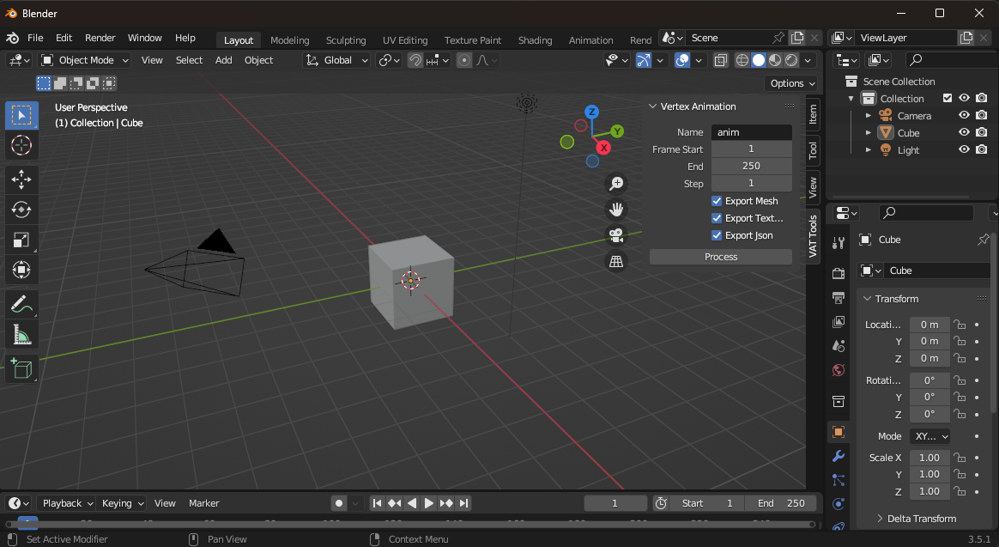
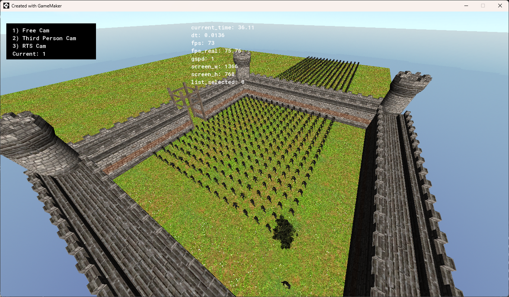
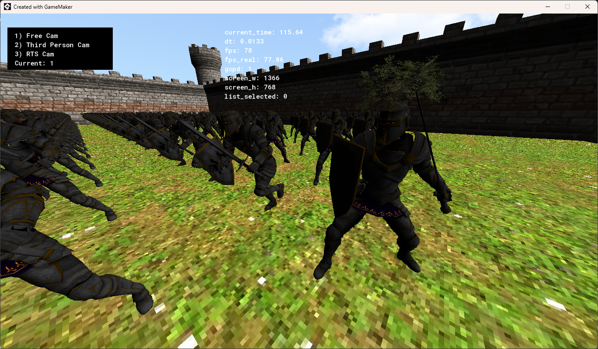
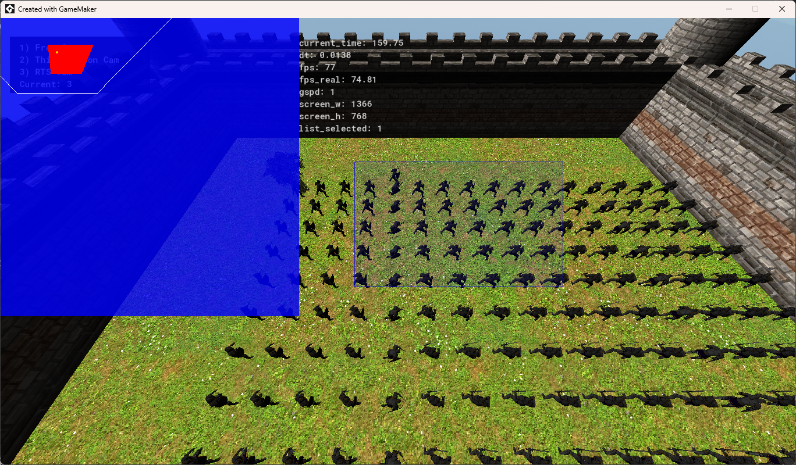

# vatGM

> **vatGM** is an implementation of the Vertex Animation Texture technique in GameMaker.


## Table of Contents
- [vatGM](#vatgm)
  - [Table of Contents](#table-of-contents)
  - [Features](#features)
  - [Getting Started](#getting-started)
    - [Prerequisites](#prerequisites)
    - [Installation Project](#installation-project)
    - [Installation Blender](#installation-blender)
  - [Usage Demo](#usage-demo)
    - [Controls](#controls)
      - [Free camera controls](#free-camera-controls)
      - [Third Person camera controls](#third-person-camera-controls)
      - [Fixed camera controls](#fixed-camera-controls)
  - [Usage Blender](#usage-blender)
    - [Example content of a info.json file](#example-content-of-a-infojson-file)
  - [Screenshots](#screenshots)
    - [14 batches of 64 knights](#14-batches-of-64-knights)
    - [Close up](#close-up)
    - [Real Time Strategy Cam](#real-time-strategy-cam)
  - [Videos](#videos)
    - [Batch Demo 1](#batch-demo-1)
    - [Third Person Demo](#third-person-demo)
    - [Batch Demo 2 with ~1000 entities](#batch-demo-2-with-1000-entities)
  - [Authors](#authors)
  - [Acknowledgments](#acknowledgments)

## Features
* Vertex Animation Texture shader.
* Blender addon to produce offsets and normal texture.
* Animation Manager to change and blend animations.
* Dynamic Batch for VAT.

## Getting Started

### Prerequisites
Ensure you have the following installed:
- [GameMaker](https://gamemaker.io/en) (2024.8+)
- [Blender](https://www.blender.org/) (3.5.1)

### Installation Project
1. Clone the repository or download as a zip file:
```bash
git clone https://github.com/EatingLupini/vatgm.git
```

2. Open the project and launch using GMS2 VM or GMS2 YYC runtime.

### Installation Blender
1. Download the [Blender addon](blender_addon/vertex_animation_gm.py).

2. Open Blender and click on Edit -> Preferences.

3. Click on the Add-ons tab

4. Click install and select the addon file "vertex_animation_gm.py"

5. Look for VAT Tools and enable it.

Now you should have an additional panel on the right as shown in the image below:




## Usage Demo
Open the Project and launch.


### Controls

| **Button** |      **Action**     |
|------------|---------------------|
| 1          | Free camera         |
| 2          | Third person camera |
| 3          | Fixed camera        |
| P          | Pause               |
| F4         | Fullscreen          |
| ESC        | Quit demo           |

#### Free camera controls
| **Button** |  **Action** |
|------------|-------------|
| Move mouse | Look around |
| W, A, S, D | Move        |
| Space      | Fly up      |
| Ctrl       | Fly down    |

#### Third Person camera controls
|     **Button**     |  **Action** |
|--------------------|-------------|
| Move mouse         | Look around |
| W, A, S, D         | Move        |
| Shift              | Run         |
| Left mouse button  | Attack      |
| Right mouse button | Shield      |

#### Fixed camera controls
|     **Button**     |    **Action**   |
|--------------------|-----------------|
| W, A, S, D         | Move            |
| Left mouse button  | Select          |
| Right mouse button | Give move order |

## Usage Blender
1. Load a model in Blender, select it and click on "Process".
2. Choose a folder to save the images and click "Process".
3. At the end of the process, the following files are produced:
    * **model.obj** (model in a default position)
    * **model.mtl**
    * **anim_offset.png** (offsets texture, each column represents a vertex and each row represents a frame of the animation)
    * **anim_normal.png** (normals texture)
    * **info.json** (contains information about the animations, start and end frame, offsets, etc.)
4. All these files must be imported in the project as Included Files and loaded at runtime.

### Example content of a info.json file
You can manually add the attribute "tex_diffuse" which is the texture of the model.
```
{
    "animations": [
        {
            "name": "walk_forward",
            "loop": true,
            "speed": 0.5,
            "frame_start": 0,
            "frame_end": 31,
            "offset_min": -0.8262448906898499,
            "offset_max": 0.721109926700592,
            "dist": 1.547354817390442
        },
        {
            "name": "idle",
            "loop": true,
            "speed": 0.5,
            "frame_start": 381,
            "frame_end": 627,
            "offset_min": -0.7118440270423889,
            "offset_max": 0.6815999150276184,
            "dist": 1.3934439420700073
        }
    ],
    "model_name": "model.obj",
    "tex_diffuse": "tex_diffuse.png",
    "num_vertices": 7825,
    "num_frames": 628.0,
    "tex_size": 8192,
    "model_name": "model.obj",
    "offsets_tex_name": "anim_offset.png",
    "normals_tex_name": "anim_normal.png"
}
```

## Screenshots

<details>
<summary>Click to view the screenshots</summary>

### 14 batches of 64 knights


### Close up


### Real Time Strategy Cam


</details>

## Videos

<details>
<summary>Click to view the videos</summary>

### Batch Demo 1


### Third Person Demo


### Batch Demo 2 with ~1000 entities


</details>

## Authors
* Davide Modenese

## Acknowledgments
* [GMD3D11](https://github.com/blueburncz/GMD3D11) by **kraifpatrik**.
* [Mixamo](https://www.mixamo.com) for the free models used in this project.
* [Blender Addon](https://github.com/JoshRBogart/unreal_tools) adapted for GameMaker from Unreal Engine created by **Joshua Bogart**.
* Special thanks to **SerpensSolida** for his help with the project, the Model Importer and other useful scripts.
